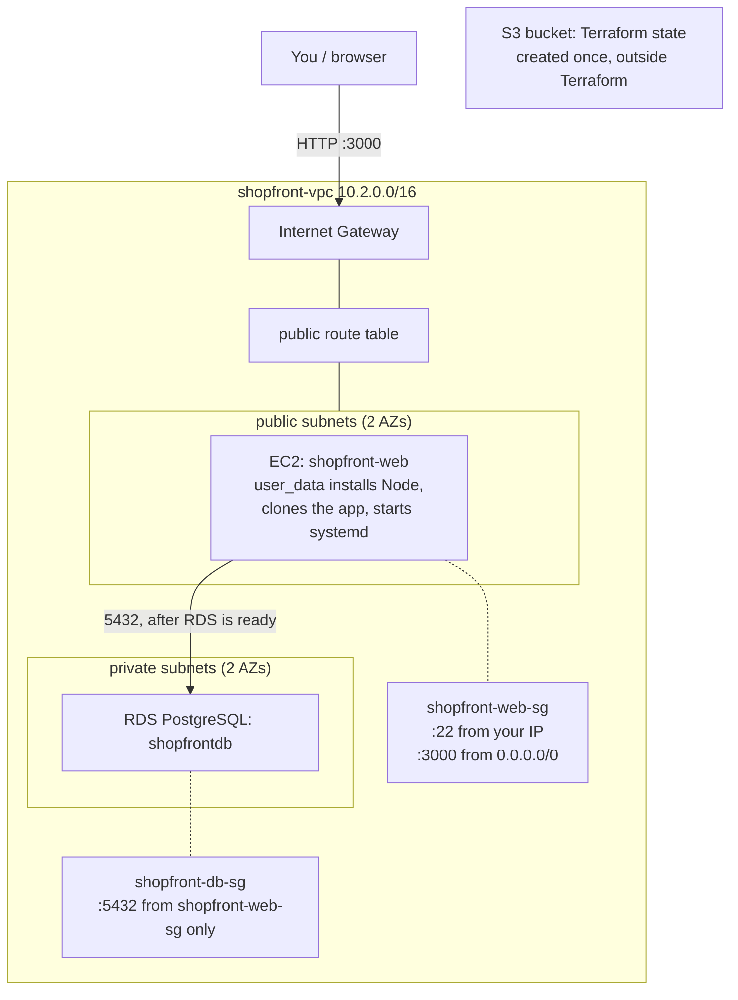

# Capstone 3 · Infrastructure as Code: Shopfront (Small-Catalog E-Commerce)

**Skill focus:** Terraform, the entire stack built together as code. By the end,
`terraform apply` alone brings up a working app from nothing, and `terraform destroy`
alone tears it back down to nothing.

## Objective

Capstone 1 taught you to build a VPC, EC2 instance, and RDS database by hand. This
capstone is where we codify that exact pattern in Terraform, together, resource by
resource. If you ever find yourself about to click something in the AWS Console while
following along, stop, that belongs in a `.tf` file instead.

## What's provided

- `app/backend`: a complete, working Node.js + Express API (`server.js`, `package.json`).
  **Do not modify the application code.** Your job is provisioning its infrastructure, not
  changing what it does.
- `app/frontend`: a small-catalog storefront UI (browse products, cart, checkout) that
  talks to the API, including real product photos.
- `app/sql/schema.sql`: the tables this app needs, pre-seeded with 8 sample products.

Notice what's missing on purpose: there's no `.tf` file anywhere in this repo yet. We
write the entire configuration together below.

## The app's contract

- `GET /health` → `200`, never touches the database.
- `GET /products`, `GET /products/:id`, `POST /orders`: catalog browsing and checkout, all
  documented at the top of `server.js`.
- Configuration comes **only** from environment variables: `PORT`, `DB_HOST`, `DB_PORT`,
  `DB_NAME`, `DB_USER`, `DB_PASSWORD`. Same contract shape you've used all course.

## Architecture we're building



Everything inside the VPC is Terraform-managed. The S3 state bucket is the one exception,
deliberately, see Step 1 for why.

## Cost awareness

| Resource | Unit price | This capstone |
| --- | --- | --- |
| EC2 `t3.micro` | ~$0.0104/hr | running the whole time you're building |
| RDS `db.t3.micro` | ~$0.018/hr + storage | running the whole time you're building |
| Public IPv4 (EC2) | $0.005/hr | running the whole time you're building |
| S3 state bucket | fractions of a cent | negligible, one small state file |

No NAT Gateway needed, same reasoning as Capstone 1. `terraform destroy` at the end
removes the VPC/EC2/RDS resources; the S3 bucket is a separate manual delete, see Cleanup.

## Step 1: Bootstrap the state bucket

Terraform's S3 backend needs the bucket to already exist before `terraform init` can
configure it, Terraform can't create the place it's about to store its own state about
itself. This one step happens outside Terraform, by design, and only once.

```bash
REGION=us-east-1
ACCOUNT_ID=$(aws sts get-caller-identity --query Account --output text)
BUCKET_NAME="shopfront-tfstate-$ACCOUNT_ID"
echo "$BUCKET_NAME"   # you'll need this exact name in Step 2

aws s3api create-bucket --bucket $BUCKET_NAME --region $REGION
aws s3api put-bucket-versioning --bucket $BUCKET_NAME \
  --versioning-configuration Status=Enabled
aws s3api put-public-access-block --bucket $BUCKET_NAME --public-access-block-configuration \
  BlockPublicAcls=true,IgnorePublicAcls=true,BlockPublicPolicy=true,RestrictPublicBuckets=true
```

Using your account ID in the bucket name keeps it globally unique without you having to
invent one; S3 bucket names are unique across all of AWS, not just your account.

## Step 2: Provider and backend

Create `providers.tf`:

```hcl
terraform {
  required_providers {
    aws = {
      source  = "hashicorp/aws"
      version = "~> 5.0"
    }
  }

  backend "s3" {
    bucket = "shopfront-tfstate-<ACCOUNT_ID>"
    key    = "shopfront/terraform.tfstate"
    region = "us-east-1"
  }
}

provider "aws" {
  region = "us-east-1"
}
```

Replace `<ACCOUNT_ID>` with the real value from Step 1. **Backend blocks can't reference
Terraform variables**, this is a real Terraform limitation, not an oversight, so this has
to be a literal string, not `var.account_id`.

## Step 3: Variables

Create `variables.tf`:

```hcl
variable "db_password" {
  description = "RDS master password"
  type        = string
  sensitive   = true
}

variable "my_ip" {
  description = "Your IP for SSH access, e.g. 203.0.113.4/32"
  type        = string
}

variable "key_name" {
  description = "Name of an existing EC2 key pair"
  type        = string
}
```

Find your IP first, then create `terraform.tfvars` with your real values (this file is
already gitignored, don't remove it from `.gitignore`):

```bash
curl -s https://checkip.amazonaws.com
```

```hcl
# db_password must not contain a forward slash, an at-sign, a double quote, or a space.
db_password = "ReplaceThisWithARealPassword123"
my_ip       = "203.0.113.4/32"    # the IP curl just printed, plus /32
key_name    = "replace-with-your-ec2-key-pair-name"
```

## Step 4: Network

Create `network.tf`, the same shape as Capstone 1, on its own fresh CIDR block:

```hcl
resource "aws_vpc" "main" {
  cidr_block = "10.2.0.0/16"
  tags       = { Name = "shopfront-vpc" }
}

resource "aws_subnet" "public_a" {
  vpc_id                  = aws_vpc.main.id
  cidr_block              = "10.2.1.0/24"
  availability_zone       = "us-east-1a"
  map_public_ip_on_launch = true
  tags                    = { Name = "shopfront-public-1a" }
}

resource "aws_subnet" "public_b" {
  vpc_id                  = aws_vpc.main.id
  cidr_block              = "10.2.2.0/24"
  availability_zone       = "us-east-1b"
  map_public_ip_on_launch = true
  tags                    = { Name = "shopfront-public-1b" }
}

resource "aws_subnet" "private_a" {
  vpc_id            = aws_vpc.main.id
  cidr_block        = "10.2.10.0/24"
  availability_zone = "us-east-1a"
  tags              = { Name = "shopfront-private-1a" }
}

resource "aws_subnet" "private_b" {
  vpc_id            = aws_vpc.main.id
  cidr_block        = "10.2.20.0/24"
  availability_zone = "us-east-1b"
  tags              = { Name = "shopfront-private-1b" }
}

resource "aws_internet_gateway" "main" {
  vpc_id = aws_vpc.main.id
  tags   = { Name = "shopfront-igw" }
}

resource "aws_route_table" "public" {
  vpc_id = aws_vpc.main.id
  route {
    cidr_block = "0.0.0.0/0"
    gateway_id = aws_internet_gateway.main.id
  }
  tags = { Name = "shopfront-public-rt" }
}

resource "aws_route_table_association" "public_a" {
  subnet_id      = aws_subnet.public_a.id
  route_table_id = aws_route_table.public.id
}

resource "aws_route_table_association" "public_b" {
  subnet_id      = aws_subnet.public_b.id
  route_table_id = aws_route_table.public.id
}

resource "aws_security_group" "web" {
  name        = "shopfront-web-sg"
  description = "Shopfront app tier"
  vpc_id      = aws_vpc.main.id

  ingress {
    description = "SSH from you"
    from_port   = 22
    to_port     = 22
    protocol    = "tcp"
    cidr_blocks = [var.my_ip]
  }
  ingress {
    description = "App traffic"
    from_port   = 3000
    to_port     = 3000
    protocol    = "tcp"
    cidr_blocks = ["0.0.0.0/0"]
  }
  egress {
    from_port   = 0
    to_port     = 0
    protocol    = "-1"
    cidr_blocks = ["0.0.0.0/0"]
  }
  tags = { Name = "shopfront-web-sg" }
}

resource "aws_security_group" "db" {
  name        = "shopfront-db-sg"
  description = "Shopfront database tier"
  vpc_id      = aws_vpc.main.id

  ingress {
    description     = "Postgres from the web tier only"
    from_port       = 5432
    to_port         = 5432
    protocol        = "tcp"
    security_groups = [aws_security_group.web.id]
  }
  egress {
    from_port   = 0
    to_port     = 0
    protocol    = "-1"
    cidr_blocks = ["0.0.0.0/0"]
  }
  tags = { Name = "shopfront-db-sg" }
}
```

## Step 5: Database

Create `database.tf`.

**This is the one line in this entire capstone most likely to cause a problem later if
it's missing: `skip_final_snapshot = true`.** Without it, AWS refuses to delete an RDS
instance unless you provide a final snapshot name, which means `terraform destroy` will
fail partway through, leaving RDS (and its hourly cost) stuck running. This is the
single most common way this specific capstone quietly turns into an ongoing bill.

```hcl
resource "aws_db_subnet_group" "main" {
  name       = "shopfront-db-subnet"
  subnet_ids = [aws_subnet.private_a.id, aws_subnet.private_b.id]
  tags       = { Name = "shopfront-db-subnet" }
}

resource "aws_db_instance" "main" {
  identifier              = "shopfront-db"
  engine                  = "postgres"
  instance_class          = "db.t3.micro"
  allocated_storage       = 20
  db_name                 = "shopfrontdb"
  username                = "shopfront_admin"
  password                = var.db_password
  db_subnet_group_name    = aws_db_subnet_group.main.name
  vpc_security_group_ids  = [aws_security_group.db.id]
  publicly_accessible     = false
  skip_final_snapshot     = true
  tags                    = { Name = "shopfront-db" }
}
```

## Step 6: Compute, and the boot script

The instance needs to install Node, pull the app, apply the schema, and start it, all
without you SSHing in. Create `userdata.sh.tpl`:

```bash
#!/bin/bash
set -e

dnf install -y nodejs npm git postgresql15

mkdir -p /opt/shopfront
git clone <your-fork-url> /tmp/shopfront
cp -r /tmp/shopfront/app/backend/* /opt/shopfront
cd /opt/shopfront && npm install --omit=dev

cat <<ENV > /opt/shopfront/.env
PORT=3000
DB_HOST=${db_host}
DB_PORT=5432
DB_NAME=shopfrontdb
DB_USER=shopfront_admin
DB_PASSWORD=${db_password}
ENV

chown -R ec2-user:ec2-user /opt/shopfront

psql "host=${db_host} port=5432 dbname=postgres user=shopfront_admin password=${db_password}" \
  -c "CREATE DATABASE shopfrontdb;" || true
psql "host=${db_host} port=5432 dbname=shopfrontdb user=shopfront_admin password=${db_password}" \
  -f /tmp/shopfront/app/sql/schema.sql

cat <<SERVICE > /etc/systemd/system/shopfront.service
[Unit]
Description=Shopfront API
After=network.target

[Service]
Type=simple
User=ec2-user
WorkingDirectory=/opt/shopfront
EnvironmentFile=/opt/shopfront/.env
ExecStart=/usr/bin/node server.js
Restart=always

[Install]
WantedBy=multi-user.target
SERVICE

systemctl daemon-reload
systemctl enable --now shopfront
```

User data runs as root, so none of this needs `sudo`. `chown` happens after `npm install`
on purpose, so `node_modules` ends up owned by `ec2-user` too, not just the files copied
in before it. The `|| true` on `CREATE DATABASE` exists so a Terraform re-apply that
replaces the instance doesn't fail on a database that's already there from last time.

One thing to know if you ever extend this script: `${db_host}` and `${db_password}` are
substituted by Terraform's `templatefile()` function before this ever reaches the
instance, and it uses the exact same `${...}` syntax bash uses for its own variable
expansion. If you add a real bash variable reference like `${SOME_VAR}` anywhere in this
file, Terraform will try to substitute it too and fail with an unknown-variable error
unless you escape it as `$${SOME_VAR}`.

Now create `compute.tf`:

```hcl
data "aws_ami" "al2023" {
  most_recent = true
  owners      = ["amazon"]

  filter {
    name   = "name"
    values = ["al2023-ami-*-x86_64"]
  }
  filter {
    name   = "virtualization-type"
    values = ["hvm"]
  }
}

resource "aws_instance" "web" {
  ami                    = data.aws_ami.al2023.id
  instance_type          = "t3.micro"
  subnet_id              = aws_subnet.public_a.id
  vpc_security_group_ids = [aws_security_group.web.id]
  key_name               = var.key_name

  user_data = templatefile("${path.module}/userdata.sh.tpl", {
    db_host     = aws_db_instance.main.address
    db_password = var.db_password
  })

  tags = { Name = "shopfront-web" }

  # Without this, Terraform can launch the EC2 instance before RDS finishes
  # provisioning (RDS regularly takes 5-10 minutes, EC2 boots in under a
  # minute), and user_data would try to connect to a database that doesn't
  # exist yet.
  depends_on = [aws_db_instance.main]
}
```

Using a `data "aws_ami"` lookup instead of a hardcoded AMI ID matters here specifically:
hardcoded AMI IDs are region-specific and go stale as AWS publishes new AL2023 builds:
this way `terraform apply` always picks up the current one.

## Step 7: Outputs

Create `outputs.tf`:

```hcl
output "app_url" {
  value = "http://${aws_instance.web.public_ip}:3000"
}

output "rds_endpoint" {
  value = aws_db_instance.main.address
}
```

## Step 8: Apply it

```bash
terraform init      # configures the S3 backend from Step 2
terraform plan       # review what it's about to create before you apply
terraform apply
```

`terraform apply` will sit on the RDS instance for 5-10 minutes, that's normal RDS
provisioning time, not Terraform hanging. Because of the `depends_on` in Step 6, the EC2
instance won't launch (and `user_data` won't run) until RDS reports available.

## Verification

```bash
terraform output app_url
curl -s "$(terraform output -raw app_url)/health"
curl -s "$(terraform output -raw app_url)/products"
```

`GET /products` should return the 8 seeded products. If `/health` works but `/products`
doesn't, `user_data` likely ran before RDS was ready or `schema.sql` didn't apply; SSH in
and check `sudo journalctl -u shopfront` and `/var/log/cloud-init-output.log` for what
actually happened during boot.

## What you get to decide yourself

Whether you split this into modules instead of one flat set of `.tf` files, instance
sizing, whether you add DynamoDB state locking on top of the S3 backend (a genuinely good
idea, not required), and whether `user_data` pulls the app via `git clone` (shown above)
or a pre-built artifact from S3.

## Cleanup

```bash
terraform destroy
```

This should remove the VPC, EC2 instance, RDS instance, and everything else it created, in
the correct dependency order, automatically, and it will actually complete instead of
hanging on RDS specifically because of `skip_final_snapshot = true` in Step 5.

The S3 state bucket is the one thing `terraform destroy` doesn't touch, since it lives
outside this configuration on purpose. Delete it separately once you're fully done with
the capstone (this is a new terminal session, so re-derive the bucket name rather than
assuming `$BUCKET_NAME` is still set from Step 1):

```bash
ACCOUNT_ID=$(aws sts get-caller-identity --query Account --output text)
BUCKET_NAME="shopfront-tfstate-$ACCOUNT_ID"

aws s3 rm s3://$BUCKET_NAME --recursive
aws s3api delete-bucket --bucket $BUCKET_NAME --region us-east-1
```

Self-check against `RUBRIC.md` in this same folder as you go, not just at the end.
